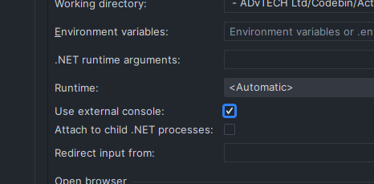
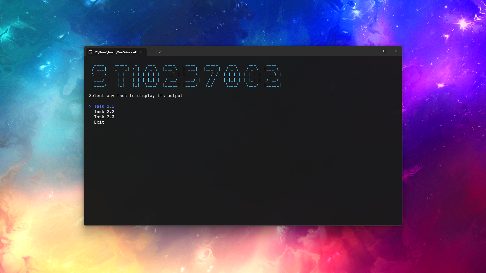
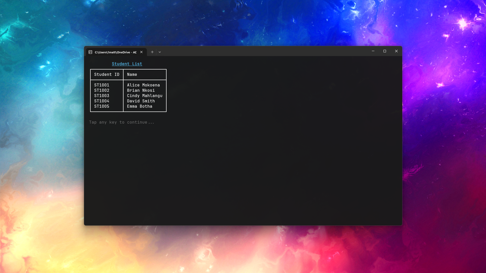
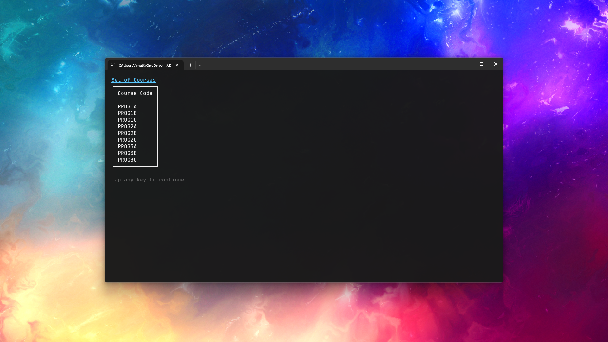
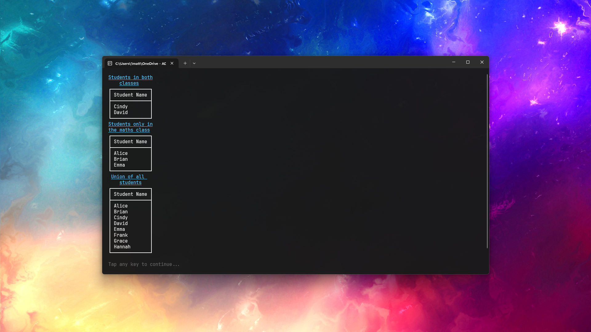

# ICE Task 2

> ST10257002

## Getting started

### Compiling the source code

See the [official documentation](https://docs.github.com/en/repositories/creating-and-managing-repositories/cloning-a-repository) for more information.

If you do not have Git installed and set up on your local machine, you can download a ZIP archive of the repository under the <kbd><> Code</kbd> dropdown menu. To compile the source code, run Visual Studio 2022 (or later versions) and open the uncompressed folder, then compile the project from the IDE. To do so, click the green run icon at the top of the screen.

#### Clone using a Command Line Interface (CLI)

1. Create/open an empty folder on your local machine to store the project files.
2. Open a terminal window and navigate to the directory of the folder.
- **Windows:** To do this in an efficient manner, enter the folder in the default file explorer and click on the address bar. Then, type <kbd>C</kbd> <kbd>M</kbd> <kbd>D</kbd> followed by <kbd>Enter</kbd> to directly initialise a Windows terminal at the directory of your folder. This works with PowerShell in the same way. Watch a short [video guide](https://youtu.be/N7IqS3PX3YA?t=80) here.
3.  Clone this repository using the following command:

``` bash
git clone https://github.com/mattpieterse/P3B-ICE-Task-02.git
```

### Facing issues?

If the tables are not rendering correctly to your terminal, you need to use a terminal that supports
ANSI ouput (like PowerShell). In your IDE run configurations, you should see a toggle to use an
external console as the compilation target. Apply and re-run, or refer to the screenshots below.



## Overview of the tasks completed

### Home

This is the screen that you will be presented with on-launch. You can select any one of the provided
tasks to see its output live in the console window, and select the last option to close the
application.



### Task 1



### Task 2



### Task 3



## Contribution

This repository is private and has been released into the public domain with the intention of code
submission. All issues and pull requests will be ignored, do not attempt to modify and/or contribute
to this repository in any way as it is the work of an individual.